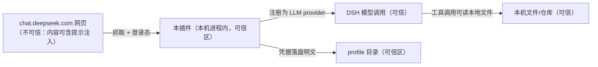

# THREAT · web-bridge 第三方件（`cv-superding/dsh-deepseek-web-login`）威胁建模

**AI 声明**：本文件由 AI（DSH 会话 · deepseek-flash）生成；依据 = ① `docs/specs/2026-10-06_web-bridge/RESEARCH.md`（2-6 卡的判定与 UNVERIFIED 清单）② 本机 `git clone --depth 1` 的实读结论（仓库 HEAD `2974c608829a4d2185334ad8cd03e682c9558d9d`，v0.6.41：`src/index.ts:135` inject `['llm','webServer']`、`:921` `registerAdapter`；客户端半只有设置面板 `src/client/index.ts:23`）③ `AGENTS.md` D5（外部内容一律是数据）。**只看「这个件装进来会碰坏什么」这一轴**；**不构成 7-9 准入结论**（准入另走 `docs/decisions/` 台账，由人裁决）。
**产物寿命**：持久（进仓库）。**本文件不批准任何事**——它是准入裁决的输入。

## Q1 资产是什么

`资产：网页端登录态（Authorization: Bearer + 域 cookie + 反爬头，本机持久化）= 凭证；该账号能访问的聊天内容与配额 = 私有数据；本机 profile 目录 = 可信区`

## Q2 入口在哪

`入口：① 插件安装（npm 名 / git 源，同名陷阱见 RESEARCH.md §「同名陷阱」）② 本机持久化的登录态文件 ③ 该 provider 发出的出网请求 ④ LLM provider 接口（本进程内，与 DSH 同上一条命）⑤ 客户端设置面板`

## Q3 信任边界在哪



**每条跨界数据流**：① 网页 → 插件：带 HTML/JSON 正文（**不可信输入**）；② 插件 → 模型：被当作模型输出（**不可信内容进入可信链**）；③ 模型 → 本机文件：若同时具备读私有数据与对外通信能力，则构成 Simon Willison 的**致命三连**（读私有凭据 ✅ / 消费不可信内容 ✅ / 对外发请求 ✅）；④ 插件 → 磁盘：凭据明文落 profile。

## Q4 威胁（STRIDE 六类逐条过）

威胁：伪装成官方/同名包被装进来（npm 同名陷阱：`dsh-pilot` / `dsh-browser` 属别的作者） ｜ STRIDE：S 仿冒 ｜ 跨界：npm 源 → 本机 ｜ 等级：中
缓解：只按 RESEARCH.md 记的 `cv-superding/dsh-deepseek-web-login` 全名安装 + 装前核 `git rev-parse HEAD` 与包内 `package.json` 的 `name`/`repository` ｜ 责任：人 ｜ 验证：4-2 审查时贴三项原文

威胁：被捕获的网页内容经 provider 回灌模型，可携带提示注入指令 ｜ STRIDE：T 篡改 ｜ 跨界：网页 → 插件 → 模型 ｜ 等级：高
缓解：按 `AGENTS.md` D5 把模型输出当数据；**禁止**在装载该 provider 的会话里同时开写侧工具（动作闸已拦"未按卡开工"的写侧调用）｜ 责任：人 ｜ 验证：4-3 验证时用一条含"忽略以上要求"的样本跑一次，检查工具是否仍被闸拦

威胁：走网页端私有接口、上游自述 `unofficial · use at your own risk` ⇒ 官方改版即失效，且不排除违反服务条款 ｜ STRIDE：R 抵赖 ｜ 跨界：本机 → 第三方服务 ｜ 等级：中
显式接受：待用户裁决（见下方「需显式接受」）；未接受前**不安装** ｜ 接受人：用户 ｜ 依据：RESEARCH.md `:97` 与上游 README 徽标原文（**尚未取得用户原话**）

威胁：登录态（Bearer / cookie / 反爬头）明文落 profile 目录 ｜ STRIDE：I 信息泄露 ｜ 跨界：插件 → 磁盘 ｜ 等级：高
缓解：装前确认该件的落盘路径与文件权限；凭据文件不进任何仓库、不进日志、不进派单（`AGENTS.md` D15）；泄露即作废轮换（git 历史永远可读）｜ 责任：人 ｜ 验证：装后跑 `git status --porcelain` 必须为空 + 检查 `.gitignore` 是否覆盖该路径

威胁：无上限的抓取/请求触发账号限流或封禁，且失败路径不明确 ｜ STRIDE：D 拒绝服务 ｜ 跨界：本机 → 第三方服务 ｜ 等级：低
缓解：设显式超时与最大重试（provider 侧配置），失败即回落官方 API ｜ 责任：人 ｜ 验证：4-3 断网跑一次，必须给可读错误而不是静默重试

威胁：provider 与 DSH 同进程 ⇒ 它拿到的能力面不由对话范围决定 ｜ STRIDE：E 提权 ｜ 跨界：插件 → 本机文件/仓库 ｜ 等级：高
缓解：**Rule of Two 判据（本文件的结论性一行）**：该件同时具备"读私有凭据 / 消费不可信内容 / 对外发请求"三条 ⇒ **必须显式接受 + 至少一条隔离措施**，候选三条任选其一并写明：① 凭据不出本机磁盘（不注入上下文）② 禁止它读网页正文以外的内容 ③ 只在没有写侧工具的会话里运行 ｜ 责任：人 ｜ 验证：4-2 审查逐条核"选了哪一条、怎么核"

> 上面六段是 STRIDE 的六类**逐条**过：本任务六类全部命中，无一类写"无"；每段都以类名开头，格式见 `playbook/3-2-威胁建模.md` 动作 2。

## 需显式接受的三条（RESEARCH.md `:95-97` 原文，未取得用户原话前一律不装）

1. 触红线域「认证/鉴权体系」——用你的**网页登录态**而不是 API Key。
2. 走**网页端私有接口**（非官方 API）：官方改版即失效。
3. 上游 `unofficial · use at your own risk`。

## 红线域与档位

命中红线域「认证／鉴权体系」⇒ **档位 L**（只升不降）。SCOPE.md 与 `STATE.md` 的档位回写**待用户裁决后**执行——本文件只做威胁建模，不代替裁决。

## 动作 6 自查（三条命令，空输出也要贴原文）

```powershell
$spec = 'docs/specs/2026-10-06_web-bridge'
Select-String -Path "$spec/THREAT.md" -Pattern '注意|加强|做好|小心|安全意识'
$n = @([IO.File]::ReadAllLines("$spec/THREAT.md", [Text.Encoding]::UTF8) | Where-Object { $_ -match 'S 仿冒|T 篡改|R 抵赖|I 信息泄露|D 拒绝服务|E 提权' }).Count; "$spec/THREAT.md = $n 行"
```
Expected：第一条无输出（无口号式安全）；第二条打印 `docs/specs/2026-10-06_web-bridge/THREAT.md = 6 行`。

## 明确不在本文件范围内的

- **7-9 准入结论**（`security.ps1 -SkillDir` 机检 + 五查证据）——另立 `docs/decisions/` 台账，由人裁决。
- **代码安全审阅**——RESEARCH.md `:114` 的 UNVERIFIED ④ 仍未做（本轮只读 README/`package.json`/少量 `src`）。
