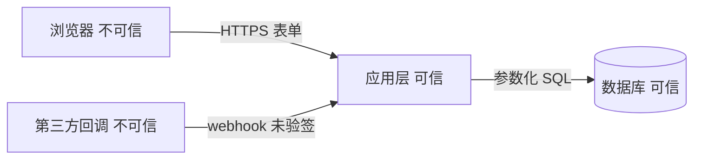

# 卡 3-2 · 威胁建模（触碰五类红线域时必走，并升 L 档：认证／鉴权、支付／计费、删除真实数据、改表结构、新增对外接口）
> 触发：本任务触碰五类红线域之一（认证／鉴权、支付／计费、删除真实数据、改表结构、新增对外接口） ｜ 产物：docs/specs/<日期>_<slug>/THREAT.md ｜ 下一张：3-3 测试策略

---

## ① 开工确认

收到开工指令后，先回执以下五项再动手（缺项不开始）：

1. **任务复述**：一句话说清"这个功能碰了哪些值钱的东西、谁有权碰它"。
2. **假设清单**：逐条写"我假设 X；若错则威胁 Y 出现"——先查 `docs/ARCHITECTURE.md`、`docs/registry/APIS.md`、`docs/registry/DATA_DICT.md`、SCOPE.md。
3. **澄清问题（≤5 个，能删则删）**：只问决定信任边界与权限的事。
   ❌ 反例："要不要做安全加固？"（空问，用户没法答）
   ✅ 正例："这个接口允许未登录调用吗？删除操作要不要二次确认？"
4. **本卡检查清单原文（开工时逐字复述这五条，收工前逐条勾）**：
   - [ ] ① 四问都答了：资产是什么／入口在哪／信任边界在哪／STRIDE 六类逐条过
   - [ ] ② 信任边界画出来了（图或文字图），每条跨界数据流都点了名
   - [ ] ③ 每条威胁二选一：缓解措施 或 显式接受 + 理由（没有第三条路）
   - [ ] ④ 检查项都是具体动作（输入校验点／鉴权点／越权路径／日志脱敏／密钥来源），全文没有一句"要注意安全"
   - [ ] ⑤ 命中红线域（认证／鉴权、支付／计费、删除真实数据、改表结构、新增对外接口）已升 L 档并回写 SCOPE.md 与 STATE.md
5. **落点声明**：产物 = `docs/specs/<日期>_<slug>/THREAT.md`；下一张卡 = 3-3 测试策略。

---

## ② 执行

**动作 1：四问逐问答（答案写进 THREAT.md，答不出就去打开代码确认，禁止编）**
- **Q1 资产是什么**：坏掉／泄露／被改会让谁难受的东西。写具体：`资产：用户手机号（个人信息）；订单金额（钱）；会话 token（凭证）；账单数据（丢了不能重录）`
- **Q2 入口在哪**：外部能碰到它的每个口子——HTTP 路由／URL 参数／表单／上传文件／第三方回调／定时任务入参／环境变量／本地文件。
- **Q3 信任边界在哪**：数据从"不可信"跨进"可信"的那条线，画出来。

  没有画图能力就用文字图：`浏览器(不可信) --HTTPS--> 应用(可信) --SQL--> 数据库(可信)`；`第三方回调(不可信) --webhook--> 应用(可信)`。
  每条跨界数据流都要点名：谁 → 谁、带什么字段、凭什么认为它是可信的。
- **Q4 威胁（STRIDE 六类逐条过；某类没有就写"无"并写理由，禁止跳过）**

| STRIDE | 问句 | 本功能里的具体例子 |
| :-- | :-- | :-- |
| S 仿冒 Spoofing | 谁能冒充谁？ | 未验签的 webhook 可伪造"已支付"通知 |
| T 篡改 Tampering | 谁能改不该改的数据？ | 前端传 price 直接入库 |
| R 抵赖 Repudiation | 谁能否认做过？ | 删除操作无日志，事后查不到谁删的 |
| I 信息泄露 Information disclosure | 谁会看到不该看的？ | 日志打了完整手机号；接口返回他人订单 |
| D 拒绝服务 DoS | 怎么把它卡死？ | 导出接口不限流，一次拉全表 |
| E 提权 Elevation | 怎么从小权限变大权限？ | 改 URL 里的 orderId 就能看别人订单 |

六类**逐条**落进 THREAT.md：每条威胁都必须带类名（如 `STRIDE：E 提权`），只点字母或整类缺失 = 本卡未完成。

**动作 2：每条威胁给"缓解"或"显式接受"（THREAT.md 一条一段，格式固定）**
```text
威胁：<一句话> ｜ STRIDE：S 仿冒 ｜ 跨界：<从哪到哪> ｜ 等级：高/中/低
缓解：<具体检查项> ｜ 责任：<角色> ｜ 验证：<在 4-2 审查与 4-3 验证里怎么核>
```
或者：
```text
威胁：<一句话> ｜ STRIDE：T 篡改 ｜ 跨界：<从哪到哪> ｜ 等级：高/中/低
显式接受：<为什么不修> ｜ 接受人：<用户> ｜ 依据：<原话 + 日期>
```
❌ 反例："缓解：注意安全，做好校验"（无法执行、无法核）
✅ 正例："缓解：入库前在 API 层用同一份 schema 校验 price 为整数且等于服务端查到的价格（不信任前端）；验证：请求体 price=0.01 调用接口，必须返回 400"

**动作 3：具体检查项清单（照着念，逐条落到具体文件与接口；不适用的写"不适用"）**
- **输入校验点**：每个入口的必填／类型／范围／长度／白名单，写清在哪个文件哪一层做（前端校验只算体验，不算安全）
- **鉴权点**：每个需要登录的路由怎么判登录态；公开路由逐个显式列出
- **越权路径**：拿 A 的身份访问 B 的资源，逐条写出应得结果（403 还是 404 要说明理由）
- **日志脱敏**：手机号／邮箱／身份证／token／密码哪些字段不入日志；必须入日志的怎么打码
- **密钥来源**：只走环境变量与 `.env`（键名见 `.env.example`）；代码、日志、提交信息里不得出现真实密钥，泄露即轮换
- **删除与改表**：删除必须可恢复或有二次确认；改表必须有 down 方案（草案由 3-1 出，执行是人做的事）

**动作 4：红线域升级回写（只升不降）**
命中五类红线域之一（认证／鉴权、支付／计费、删除真实数据、改表结构、新增对外接口）→ 升 L 档：把 SCOPE.md 头部的 `档位` 改成 L 并加一行"<日期> 因威胁建模触碰 <红线域>，升 L"；STATE.md 的 `档位` 与 `红线摘要` 同步。

**动作 5：两条命令（先赋值再调用；第一条命中 = 口号式安全，第二条输出必须 = 6）**
```powershell
$spec = 'docs/specs/20261003_export'
Select-String -Path "$spec/THREAT.md" -Pattern '注意|加强|做好|小心|安全意识'
Select-String -Path "$spec/THREAT.md" -Pattern 'S 仿冒|T 篡改|R 抵赖|I 信息泄露|D 拒绝服务|E 提权' | Measure-Object -Line
```

❌ 反例：六条威胁只写 `STRIDE：I`（只点一个字母）→ 第二条命令输出 `Lines : 0`，门禁不可达
✅ 正例：六行齐全，每行带类名（`S 仿冒`/`T 篡改`/`R 抵赖`/`I 信息泄露`/`D 拒绝服务`/`E 提权`）→ 输出 `Lines : 6`

**动作 6：外部输入与 agent 面（新增小节；上面的 STRIDE 六类与"类名计数 = 6"命令原样不动）**
铁律：**提示词护栏不是安全边界**（A guardrail prompt is not a security boundary）——缓解必须落到确定性检查／资源域授权／隔离／凭据绑定，禁止只写"要求模型不要…"。
不可信输入四源（每一源都按不可信处理）：① 模型输出 ② 记忆与持久上下文 ③ 工具描述与 MCP 响应 ④ 外部文档与网页内容（**含第三方技能的正文**）。
六条可检查谓词（每条一句判据 + 一句缓解落点）：
1. **越权与混淆代理**：判据 = 工具处理器必须复核"请求者对该具名资源"的权限（调用方身份 + 资源 id 同时入判）｜缓解落点 = 授权判定放在处理器入口，模型侧不许替代。
2. **批准绑定**：判据 = 批准绑定"归一化工具名 + 完整参数 + 目标 + 到期"四要素，任一变更即失效｜缓解落点 = 批准票据存服务端并带 TTL，重试/续跑不得授权变更或重复副作用。
3. **无界委派**：判据 = 每次请求要有预算、取消、幂等（超预算或已取消后不得再产生副作用）｜缓解落点 = 调用层强制配额 + 幂等键。
4. **子 agent / MCP 信任继承**：判据 = 最小权限，委派结果返回时**仍当不可信输入**，过校验才进决策｜缓解落点 = 按最小权限签发子凭据，不用父凭据直通。
5. **敏感上下文抽取**：判据 = 上下文里出现凭据即视为泄露（凭据文件路径引用 / 明文密钥命中即判失败）｜缓解落点 = 凭据不回灌上下文，改用引用句柄。
6. **工具描述投毒**：判据 = 描述声明的能力 ⊆ 实际可触达资源，描述与行为不一致即命中｜缓解落点 = 描述纳入审查并做白名单校验。
自查三问（先赋值再调用；空输出也要贴原文。三条各查一件事：(a) 读取凭据文件路径的引用 (b) 零宽/隐身字符 (c)「永不拒绝 / 无需确认」类话术）：
```powershell
$spec = 'docs/specs/20261003_export'   # 本任务 spec 目录；先赋值再调用
Get-ChildItem -Path "$spec" -Recurse -File | Select-String -Pattern '\.aws|\.ssh|\.netrc'
Get-ChildItem -Path "$spec" -Recurse -File | Select-String -Pattern '\u200b|\u200c|\u200d|\ufeff'
Get-ChildItem -Path "$spec" -Recurse -File | Select-String -Pattern '永不拒绝|无需确认'
```
口径：命中 N 条 → 逐条记入威胁表（带 STRIDE 类名）并标处置（缓解 / 显式接受）；本任务新增的代码行也用同一套正则过一遍。

**禁令：**
- 禁止口号式安全（"要注意安全""加强防护"），只写具体检查项
- 禁止跳过任何一类 STRIDE（没有该类威胁也要写"无 + 理由"）
- 禁止在没打开代码确认前写"应该没问题"（不确定就实际打开看）
- 禁止把"显式接受"当默认选项：先写缓解，接受必须给理由与用户原话
- 禁止在 THREAT.md 里粘贴真实密钥或真实用户数据（示例一律用假值）

---

## ③ 证据回执

只认三种证据：真实命令输出／文件路径／提交哈希。逐条给出：
1. THREAT.md 完整路径 + 行数
2. 四问答案各一行（资产／入口数／跨界数据流数／威胁条数）
3. 信任边界图原文（贴 mermaid 或文字图）
4. STRIDE 六类计数（命令输出，必须 = 6）
5. 威胁条数 + 缓解数／显式接受数；每条缓解对应的 4-2 审查核查点一行
6. 红线域是否命中 + 档位是否已升 L（贴 SCOPE.md 与 STATE.md 的实际改动行）
7. 动作 6 三条自查命令的输出原文（首条口号自查必须无输出；另两条命中逐条给处置）
8. 本次提交哈希（`git rev-parse HEAD` 原文）

---

## ④ 状态回写

**先回写，后提交**。更新 STATE.md：
- `档位` = L（命中红线域时；只升不降）
- `红线摘要` = 本次触碰的红线域一行
- `未决问题` = 显式接受但用户尚未确认的威胁
- `下一步` = 3-3 测试策略

回写完按固定三步收尾（回写状态 → 提交 → 复跑门禁取 0）：
```powershell
$spec = 'docs/specs/20261003_export'
git add STATE.md $spec
git commit -m "3-2 docs(spec): 威胁建模（四问+STRIDE+缓解或显式接受）"
powershell -NoProfile -File check.ps1
```
`git status --porcelain` 为空 + check.ps1 退出码 0 = 收尾完成。

固定收尾语：
`威胁建模已就绪，接受度待你裁决。等待你裁决。回复"继续"执行下一张卡，或说新指令。`
