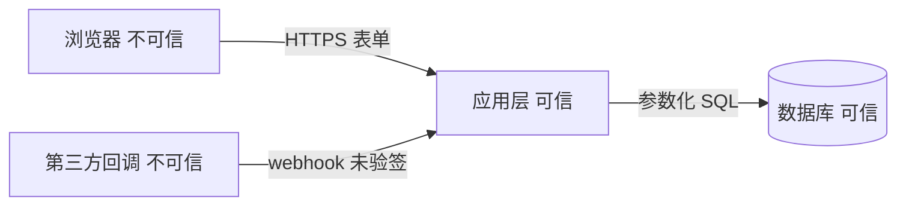

# Card 3-2 · Threat modeling (mandatory when any of the five red-line domains (authentication/authorization, payment/billing, deleting real data, changing the table schema, adding an external-facing interface) is touched, and the tier rises to L)
> Trigger: this task touches any of the five red-line domains (authentication/authorization, payment/billing, deleting real data, changing the table schema, adding an external-facing interface) ｜ Output: docs/specs/<date>_<slug>/THREAT.md ｜ Next: 3-3 Test strategy

---

## ① Start confirmation

After receiving the start instruction, first receipt the following five items before acting (a missing item means do not start):

1. **Restate the task**: in one sentence, say "which valuable things this feature touches, and who has the right to touch them".
2. **Assumptions list**: write "I assume X; if that is wrong then threat Y appears" line by line — look up `docs/ARCHITECTURE.md`, `docs/registry/APIS.md`, `docs/registry/DATA_DICT.md`, SCOPE.md first.
3. **Clarifying questions (≤5, delete any that can be deleted)**: ask only about things that decide the trust boundary and the permissions.
   ❌ Counter-example: "要不要做安全加固？" ("Should we harden security?") — an empty question the user cannot answer
   ✅ Good example: "这个接口允许未登录调用吗？删除操作要不要二次确认？" ("May this interface be called without logging in? Does the delete need a second confirmation?")
4. **Paste this card's checklist verbatim (repeat these five lines word for word at start, tick them one by one before closing)**:
   - [ ] ① All four questions are answered: what the assets are / where the entry points are / where the trust boundary is / all six STRIDE categories walked one by one
   - [ ] ② The trust boundary is drawn (a diagram or a text diagram), and every data flow that crosses it is named
   - [ ] ③ Every threat takes one of two paths: a mitigation, or explicit acceptance + a reason (there is no third path)
   - [ ] ④ Every check item is a concrete action (input validation point / authentication point / privilege-escalation path / log redaction / secret source); nowhere in the text does "要注意安全" ("pay attention to security") appear
   - [ ] ⑤ A red-line area was hit (authentication/authorization, payment/billing, deleting real data, changing the table schema, adding an external-facing interface) and the tier has risen to L with SCOPE.md and STATE.md written back
5. **Landing declaration**: output = `docs/specs/<date>_<slug>/THREAT.md`; next card = 3-3 Test strategy.

---

## ② Execution

**Action 1: answer the four questions one by one (write the answers into THREAT.md; when you cannot answer, open the code and confirm — inventing is forbidden)**
- **Q1 What are the assets**: the things whose loss, leak or change would hurt someone. Be concrete: `资产：用户手机号（个人信息）；订单金额（钱）；会话 token（凭证）；账单数据（丢了不能重录）` ("assets: user phone numbers (personal data); order amounts (money); session tokens (credentials); bill data (lost means it cannot be re-entered)")
- **Q2 Where are the entry points**: every opening through which the outside can reach it — HTTP routes / URL parameters / forms / uploaded files / third-party callbacks / scheduled-task inputs / environment variables / local files.
- **Q3 Where is the trust boundary**: the line across which data moves from "untrusted" into "trusted". Draw it.

  Without diagramming tooling, use a text diagram: `浏览器(不可信) --HTTPS--> 应用(可信) --SQL--> 数据库(可信)` (browser (untrusted) --HTTPS--> application (trusted) --SQL--> database (trusted)); `第三方回调(不可信) --webhook--> 应用(可信)` (third-party callback (untrusted) --webhook--> application (trusted)).
  Every data flow that crosses the boundary must be named: who → whom, which fields it carries, and on what grounds it is considered trusted.
- **Q4 Threats (walk all six STRIDE categories one by one; when a category has none, write "无" ("none") with a reason — skipping is forbidden)**

| STRIDE | The question | A concrete example in this feature |
| :-- | :-- | :-- |
| S 仿冒 Spoofing | who can impersonate whom? | an unsigned webhook can forge a "已支付" ("paid") notification |
| T 篡改 Tampering | who can change data they must not change? | the front end sends `price` and it goes straight into the database |
| R 抵赖 Repudiation | who can deny having done it? | deletes leave no log, so afterwards nobody can tell who deleted it |
| I 信息泄露 Information disclosure | who can see what they must not see? | the log prints the full phone number; the interface returns someone else's orders |
| D 拒绝服务 DoS | how do you wedge it? | the export endpoint is not rate limited, so one call pulls the whole table |
| E 提权 Elevation | how do you go from little privilege to more? | changing the `orderId` in the URL is enough to see someone else's order |

All six categories must land in THREAT.md one by one: every threat carries its category name (e.g. `STRIDE: E 提权`); a bare letter or a missing category = this card is not complete.

**Action 2: give every threat a "mitigation" or an "explicit acceptance" (one paragraph per threat in THREAT.md, fixed format)**
```text
Threat: <one sentence> ｜ STRIDE: S 仿冒 Spoofing ｜ Boundary crossed: <from where to where> ｜ Level: high/medium/low
Mitigation: <concrete check item> ｜ Owner: <role> ｜ Verification: <how the 4-2 review and 4-3 verification check it>
```
Or:
```text
Threat: <one sentence> ｜ STRIDE: T 篡改 Tampering ｜ Boundary crossed: <from where to where> ｜ Level: high/medium/low
Explicit acceptance: <why it is not fixed> ｜ Accepted by: <the user> ｜ Basis: <their own words + date>
```
"Level: high/medium/low" is the severity of the threat itself [disambiguated: it does not have to reuse the 2-5 risk-register level criteria].
❌ Counter-example: "缓解：注意安全，做好校验" ("mitigation: pay attention to security, validate properly") — cannot be executed and cannot be checked
✅ Good example: "缓解：入库前在 API 层用同一份 schema 校验 price 为整数且等于服务端查到的价格（不信任前端）；验证：请求体 price=0.01 调用接口，必须返回 400" ("mitigation: before writing to the database, validate at the API layer with one shared schema that `price` is an integer and equals the price the server looked up (do not trust the front end); verification: call the interface with `price=0.01` in the request body and it must return 400")

**Action 3: the concrete check-item list (read it aloud; land every item on a concrete file and interface; write "不适用" ("not applicable") where it does not apply)**
- **Input validation points**: required / type / range / length / allow-list for every entry, stating which file and which layer does it (front-end validation only counts as experience, not as security)
- **Authentication points**: how every route that needs login decides the login state; public routes listed explicitly one by one
- **Privilege-escalation paths**: accessing B's resource with A's identity, with the expected result written out one by one (403 or 404 — state the reason)
- **Log redaction**: which fields never enter the log (phone number / email / ID number / token / password); how the ones that must be logged are masked
- **Secret sources**: only environment variables and `.env` (key names in `.env.example`); no real secret may appear in code, logs or commit messages, and a leaked one is rotated immediately
- **Deleting and changing tables**: a delete must be recoverable or have a second confirmation; a table change must have a down plan (3-1 drafts it; running it is a human action)

**Action 4: red-line escalation write-back (the tier only rises, never falls)**
Hitting any of the five red-line domains — authentication/authorization, payment/billing, deleting real data, changing the table schema, adding an external-facing interface → rise to tier L: change the `档位` in the SCOPE.md header to L and add one line "<date> 因威胁建模触碰 <红线域>，升 L" ("<date>: threat modeling touched <red-line area>, rising to L"); update STATE.md `档位` and `红线摘要` in the same batch.

**Action 5: two commands (assign first, then call; a hit on the first = slogan-style security, and the second must output exactly 6)**
```powershell
$spec = 'docs/specs/20261003_export'
Select-String -Path "$spec/THREAT.md" -Pattern '注意|加强|做好|小心|安全意识'
Select-String -Path "$spec/THREAT.md" -Pattern 'S 仿冒|T 篡改|R 抵赖|I 信息泄露|D 拒绝服务|E 提权' | Measure-Object -Line
```

❌ Counter-example: all six threats write only `STRIDE: I` (a bare letter) → the second command prints `Lines : 0`, so the gate is unreachable
✅ Example: all six lines are present, each with its category name (`S 仿冒` / `T 篡改` / `R 抵赖` / `I 信息泄露` / `D 拒绝服务` / `E 提权`) → it prints `Lines : 6`

**Action 6: external input and the agent surface (a new subsection; the six STRIDE categories above and the "category count = 6" command stay exactly as they are)**
Iron rule: **A guardrail prompt is not a security boundary** — mitigations must land in deterministic checks / resource-scope authorization / isolation / credential binding; writing only "require the model not to…" is forbidden. [disambiguated: 资源域授权 = authorization scoped to the named resource, not a global role check]
Four sources of untrusted input (every source is treated as untrusted): ① model output ② memory and persistent context ③ tool descriptions and MCP responses ④ external documents and web content (**including the body of third-party skills**).
Six checkable predicates (each one criterion sentence + one mitigation landing point):
1. **Privilege escalation and the confused deputy**: criterion = the tool handler must re-check the requester's permission on that named resource (the caller's identity and the resource id must both enter the decision) ｜ mitigation landing point = the authorization decision lives at the handler's entry, not on the model side.
2. **Approval binding**: criterion = an approval is bound to four elements — normalized tool name + full arguments + target + expiry — and any change voids it ｜ mitigation landing point = approval tickets live server-side with a TTL; a retry/re-run must not authorize a change or repeat a side effect.
3. **Unbounded delegation**: criterion = every request needs a budget, cancellation and idempotency (once the budget is exceeded or the request is cancelled, no further side effect may occur) ｜ mitigation landing point = quotas enforced at the call layer + an idempotency key.
4. **Subagent / MCP trust inheritance**: criterion = least privilege, and when a delegated result comes back it **is still untrusted input** — it enters a decision only after validation ｜ mitigation landing point = issue child credentials at least privilege instead of passing the parent credential through.
5. **Sensitive-context extraction**: criterion = a credential appearing in the context counts as a leak (a credential-file path reference / a plaintext secret is a hit = failure) ｜ mitigation landing point = credentials are never fed back into the context; use reference handles instead.
6. **Tool-description poisoning**: criterion = the capabilities a description claims ⊆ the resources actually reachable; a description that disagrees with the behavior is a hit ｜ mitigation landing point = descriptions go through review and an allow-list check.
Three self-check commands (assign first, then call; paste the verbatim output even when it is empty. Each of the three checks one thing: (a) references that read credential-file paths (b) zero-width/invisible characters (c) 「永不拒绝 / 无需确认」 ("never refuses / no confirmation needed") style wording):
```powershell
$spec = 'docs/specs/20261003_export'   # this task's spec directory; assign before calling
Get-ChildItem -Path "$spec" -Recurse -File | Select-String -Pattern '\.aws|\.ssh|\.netrc'
Get-ChildItem -Path "$spec" -Recurse -File | Select-String -Pattern '\u200b|\u200c|\u200d|\ufeff'
Get-ChildItem -Path "$spec" -Recurse -File | Select-String -Pattern '永不拒绝|无需确认'
```
Criterion: N hits → record each one in the threat table (with its STRIDE category name) and mark its disposition (mitigation / explicit acceptance); the newly added code lines of this task go through the same set of regexes as well.

**Prohibitions:**
- Slogan-style security ("要注意安全" ("pay attention to security"), "加强防护" ("strengthen protection")) is forbidden; write concrete check items only
- Skipping any STRIDE category is forbidden (with no such threat, still write "无 + 理由" ("none + reason"))
- Writing "应该没问题" ("should be fine") before opening the code to confirm is forbidden (when unsure, actually open it and look)
- Treating "explicit acceptance" as the default is forbidden: write the mitigation first, and an acceptance must give a reason and the user's own words
- Pasting real secrets or real user data into THREAT.md is forbidden (examples always use fake values)

---

## ③ Evidence receipt

Only three kinds of evidence count: real command output / file paths / commit hashes. Give, item by item:
1. THREAT.md full path + line count
2. One line per answer to the four questions (assets / number of entry points / number of boundary-crossing data flows / number of threats)
3. The trust boundary diagram verbatim (paste the mermaid or the text diagram)
4. The six-category STRIDE count (command output; must be exactly 6)
5. Number of threats + number of mitigations / number of explicit acceptances; one line per mitigation naming the 4-2 review check point it maps to
6. Whether a red-line area was hit + whether the tier has risen to L (paste the actual changed lines from SCOPE.md and STATE.md)
7. The raw output of all three self-check commands from action 6 (the first slogan check must have no output; every hit from the other two gets a disposition)
8. This commit's hash (verbatim `git rev-parse HEAD`)

---

## ④ State write-back

**Write back first, commit second**. Update STATE.md:
- `档位` = L (when a red-line area was hit; the tier only rises, never falls)
- `红线摘要` = one line naming the red-line areas touched this time
- `未决问题` = threats that are explicitly accepted but not yet confirmed by the user
- `下一步` = 3-3 Test strategy

After the write-back, the closing triple (write back state → commit → re-run the gate for a 0):
```powershell
$spec = 'docs/specs/20261003_export'
git add STATE.md $spec
git commit -m "3-2 docs(spec): 威胁建模（四问+STRIDE+缓解或显式接受）"
powershell -NoProfile -File check.ps1
```
`git status --porcelain` empty + check.ps1 exit code 0 = the close-out is done.

Fixed closing line:
`Threat modeling is ready; acceptableness awaits your verdict. Awaiting your verdict. Reply "continue" to run the next card, or give a new instruction.`
