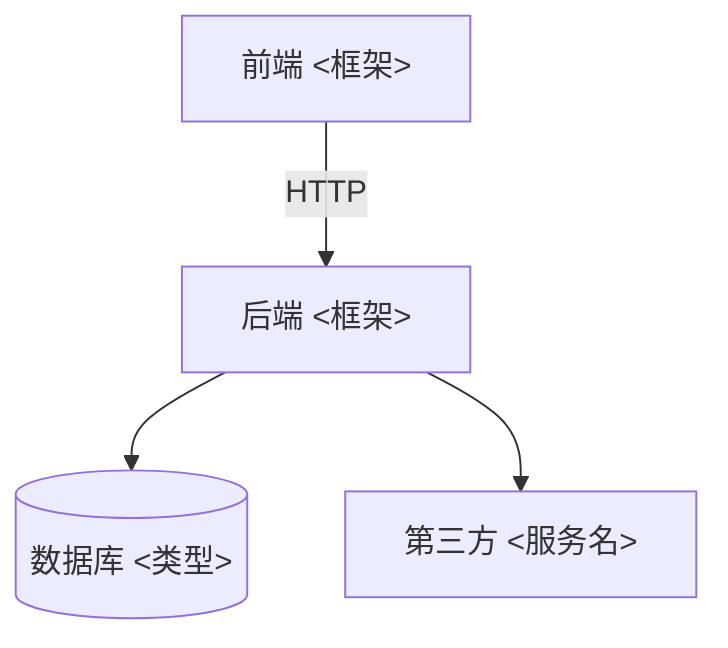

# ARCHITECTURE · 架构总览（≤100 行；agent 写代码前必读）
> 本文件回答三件事：系统由什么组成 / 数据怎么流 / 新代码放哪。
> 模块结构变了必须更新本文件（归档卡会查）。改不动 100 行 = 该拆模块了。

## 1. 模块图（11 卡按选型画；mermaid 语法可直接渲染）

## 2. 分层说明（每层一行：放什么）

| 层 | 目录 | 放什么 |
| :-- | :-- | :-- |
| 界面层 | <如 src/pages> | 页面与组件；样式与交互 |
| 接口层 | <如 src/api> | 路由定义、请求/响应 schema |
| 业务层 | <如 src/services> | 业务规则；禁止写 SQL 与 HTTP 细节 |
| 数据层 | <如 src/models> | 表模型与查询；唯一碰数据库的地方 |

## 3. 数据流（三行讲清一个典型请求）

1. 用户操作 → 界面层发请求（带什么参数）
2. 接口层校验 → 业务层处理 → 数据层读写
3. 返回 → 界面层渲染；错误 → 统一错误码（registry/APIS.md）

## 4. 新代码落点表（新建文件前必查；找不到就问，禁止乱放）

| 改动类型 | 放哪 |
| :-- | :-- |
| 新页面 | <目录> |
| 新组件 | <目录> |
| 新接口 | <目录> |
| 新表/字段 | <目录> + registry/DATA_DICT.md 登记 |
| 定时任务/脚本 | <目录> |
| 配置 | .env（真实值）/ .env.example（键名） |
