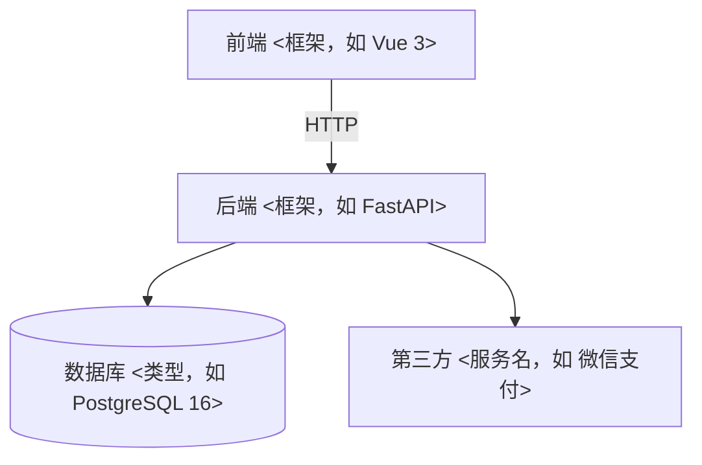

# ARCHITECTURE · 架构总览（≤100 行；agent 写代码前必读）
> 本文件回答三件事：系统由什么组成 / 数据怎么流 / 新代码放哪。
> 模块结构变了必须更新本文件（归档卡会查）。改不动 100 行 = 该拆模块了。
> **怎么填**：每处 `<…>` 都标了"由哪张卡的哪个动作填"。没走到那张卡就**留空不算违规**——S 档只有一个文件时，本文件原样保留即可。
> 一旦要填，就填成"照着念能复现"：目录写真实相对路径，框架写真实名字（版本以 `.tool-versions` 为准）。

## 1. 模块图（11 卡选型确定后画；mermaid 语法可直接渲染）

- 只有前端没有后端：删掉 API/DB 两行；没有第三方：删掉 EXT 行——**删比留空准**。

## 2. 分层说明（11 卡定目录时逐行填；每层一行：放什么）

| 层 | 目录 | 放什么 |
| :-- | :-- | :-- |
| 界面层 | <如 src/pages> | 页面与组件；样式与交互 |
| 接口层 | <如 src/api> | 路由定义、请求/响应 schema |
| 业务层 | <如 src/services> | 业务规则；禁止写 SQL 与 HTTP 细节 |
| 数据层 | <如 src/models> | 表模型与查询；唯一碰数据库的地方 |

- 小项目允许合并层：合并了就把合并后的一句话写进本表，别留两行空壳；纯前端项目删掉接口层/数据层两行。

## 3. 数据流（22 卡写方案时填；三行讲清一个典型请求）

1. 用户操作 → 界面层发请求（写出真实入口与参数）
2. 接口层校验 → 业务层处理 → 数据层读写
3. 返回 → 界面层渲染；错误 → 统一错误码（registry/APIS.md）

- 三行都要出现真实接口名/字段名，不写"某接口""相关表"。

## 4. 新代码落点表（22 卡定方案时填；新建文件前必查，找不到就问，禁止乱放）

| 改动类型 | 放哪 |
| :-- | :-- |
| 新页面 | <目录> |
| 新组件 | <目录> |
| 新接口 | <目录> |
| 新表/字段 | <目录> + registry/DATA_DICT.md 登记 |
| 定时任务/脚本 | <目录> |
| 配置 | .env（真实值）/ .env.example（键名） |

- 填不出某一行 = 这个项目还没有那一类代码 → **把行删掉**，不要留着占位让别人猜。
