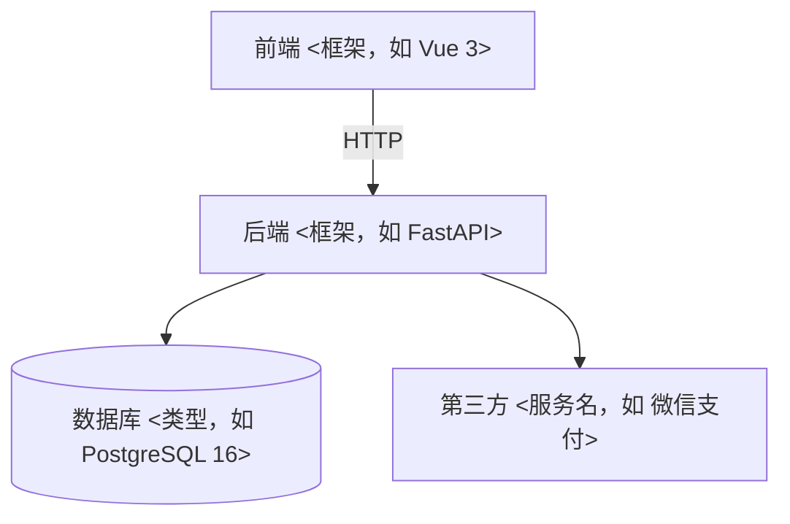

# ARCHITECTURE · 架构总览（≤150 行；agent 写代码前必读）
> 最近核对 —（骨架未核对；核对后填 <日期> @ <提交哈希>）
> 本文件回答六件事：系统由什么组成 / 数据怎么流 / 新代码放哪 / **边界画在哪** / **谁关注什么** / **拿什么换什么**。
> 模块结构变了必须更新本文件（归档卡会查）。改不动上限 = 该拆模块了。
> **怎么填**：每处 `<…>` 都标了"由哪张卡的哪个动作填"。没走到那张卡就**留空不算违规**——S 档只有一个文件时，本文件原样保留即可。
> 一旦要填，就填成"照着念能复现"：目录写真实相对路径，框架写真实名字（版本以 `.tool-versions` 为准）。
> §6~§8 是 **3-7 架构定义卡**的产物（项目首次成型 / 结构变更时走）；§1~§5 是更早就在用的部分。两者不重复：§1~§5 讲"长什么样"，§6~§8 讲"为什么长这样"。

## 1. 模块图（1-2 卡选型确定后画；mermaid 语法可直接渲染）

- 只有前端没有后端：删掉 API/DB 两行；没有第三方：删掉 EXT 行——**删比留空准**。

## 2. 分层说明（1-2 卡定目录时逐行填；每层一行：放什么）

| 层 | 目录 | 放什么 |
| :-- | :-- | :-- |
| 界面层 | <如 src/pages> | 页面与组件；样式与交互 |
| 接口层 | <如 src/api> | 路由定义、请求/响应 schema |
| 业务层 | <如 src/services> | 业务规则；禁止写 SQL 与 HTTP 细节 |
| 数据层 | <如 src/models> | 表模型与查询；唯一碰数据库的地方 |

- 小项目允许合并层：合并了就把合并后的一句话写进本表，别留两行空壳；纯前端项目删掉接口层/数据层两行。

## 3. 数据流（3-1 卡写方案时填；三行讲清一个典型请求）

1. 用户操作 → 界面层发请求（写出真实入口与参数）
2. 接口层校验 → 业务层处理 → 数据层读写
3. 返回 → 界面层渲染；错误 → 统一错误码（registry/APIS.md）

- 三行都要出现真实接口名/字段名，不写"某接口""相关表"。

## 4. 新代码落点表（3-1 卡定方案时填；新建文件前必查，找不到就问，禁止乱放）

| 改动类型 | 放哪 |
| :-- | :-- |
| 新页面 | <目录> |
| 新组件 | <目录> |
| 新接口 | <目录> |
| 新表/字段 | <目录> + registry/DATA_DICT.md 登记 |
| 定时任务/脚本 | <目录> |
| 配置 | .env（真实值）/ .env.example（键名） |

- 填不出某一行 = 这个项目还没有那一类代码 → **把行删掉**，不要留着占位让别人猜。

## 5. 非功能需求与威胁建模落点（2-4 / 3-2 卡产物；先定阈值与威胁，再写代码）

| 要落的东西 | 产物路径 | 谁写（卡号） | 什么时候写 | 验证方式（必须可测） |
| :-- | :-- | :-- | :-- | :-- |
| 非功能需求：性能 / 容量 / 可用性 / 安全 / 可维护 / 兼容 | `docs/specs/<日期>_<slug>/NFR.md`；受影响的模块约束回写本文件 §1~§4 | 2-4 卡（阈值由用户确认） | 范围确认后、动代码前 | 每条给「可测阈值 + 验证方式」（跑什么命令、看哪个指标）；给不出阈值写 `N/A（理由）`，不许留空 |
| 威胁建模：资产 / 入口 / 信任边界 / STRIDE 六类 | `docs/specs/<日期>_<slug>/THREAT.md` | 3-2 卡（触碰认证、支付、删数据、外部接口时必走） | 设计批准前 | 每条威胁给缓解措施，或显式接受并写理由；新发现的红线域改动进 SCOPE 并升 L 档 |
| 架构约束：模块边界、依赖方向、新代码落点 | 本文件 §1~§4 | 3-1 卡 | 方案确定时 | 写代码前先读本文件；越界与平行新建由 4-2 卡判红 |

- 回写时机：`NFR.md` 定了阈值，同批把受影响的约束写进本文件 §1~§4，并核对 `.tool-versions` 的版本能否满足（例：要求 Node 22 而锁的是 18 → 先改锁定文件再写代码）。
- 不适用时怎么写：某一类确实没有（如纯本地脚本无可用性要求）→ 在 `NFR.md` / `THREAT.md` 对应行写 `N/A（理由）`，理由要能判定，不许留空行。

## 6. 边界三问（3-7 卡动作 1；项目首次成型或结构变更时填）

| 问题 | 答案 | 反例（自查用） |
| :-- | :-- | :-- |
| 这是什么（一句话 ≤40 字，不带技术名词） | <谁用它做什么> | "一个用 <框架> 写的站"——说的是实现，不是系统 |
| 不做什么（≥3 条，含最容易被顺手加进来的那条） | <逐条列> | 只写"不做移动端"而漏掉"不做多用户" |
| 外面有什么（外部系统 / 人 / 定时任务，谁主动谁被动） | <逐条列> | 把数据库算成外部系统（它是 §3 的数据层） |

## 7. 干系人与关注点（3-7 卡动作 2；每一行都要有视图认领，没认领就是没做）

| 干系人 | 关注点（他到底担心什么） | 由哪个视图回答 |
| :-- | :-- | :-- |
| 用户 | <打开就能用吗 / 错了知道怎么办吗> | §3 上下文视图 + §3 运行时视图 |
| 未来的我 | <改一处要动几处 / 加功能会不会塌> | §1 模块图 + §8 权衡 |
| 运维的我 | <挂了怎么知道 / 数据丢了怎么回来> | §3 数据视图 + §5 观测 |
| 下一个 agent | <从哪开始读 / 哪些是禁区> | §6 边界三问 + 本表 |

- 单人项目不跳过这一步：这里的"干系人"是**角色**，不是组织架构。

## 8. 质量属性场景与权衡（3-7 卡动作 4~6；阈值不许自己编）

**质量属性场景 ≤5 条**，每条三要素写全（对不上 `NFR.md` 的阈值就写 `暂无阈值（理由）`）：

| 属性 | 刺激（谁在什么条件下触发） | 响应（系统做什么） | 度量（阈值来自哪一行） |
| :-- | :-- | :-- | :-- |
| <性能 / 可用性 / 可维护 / 安全 / 容量> | <条件> | <行为> | <数字；来源 `NFR.md` 第 N 行 或 `暂无阈值（理由）`> |

**权衡记录 ≥3 条**，每条写成一行：`选了 X ｜ 换来 Y ｜ 代价 Z ｜ 什么时候翻案`：

| 选了 | 换来 | 代价 | 翻案条件 |
| :-- | :-- | :-- | :-- |
| <方案> | <好处> | <付出去的东西> | <出现什么信号就回头改> |

**演化口子 ≥2 条**（现在不做、以后要做时改哪一处，不许写"以后再说"）：

1. <以后要做的事> → 改 <哪个文件 / 哪个模块>
2. <…>

- 依赖方向的铁律（禁双向、禁环、禁跨层）在 §1 模块图上自查；3-7 卡动作 8 的脚本会点名违规。
